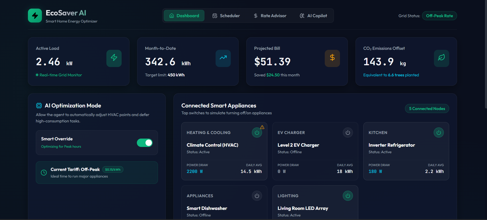
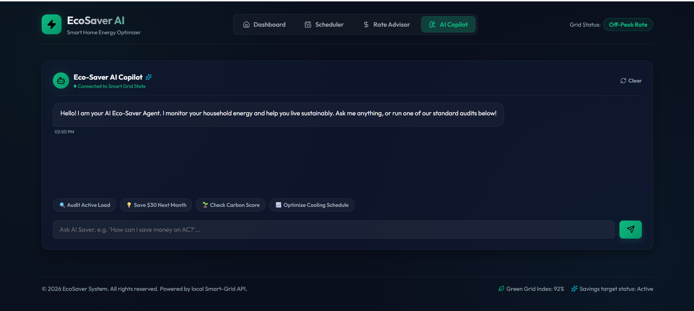

# ⚡ EcoSaver AI: An AI-Powered Smart Home Energy Saver Agent

**Subtitle:** Helping households monitor energy use, predict bills, reduce carbon emissions, and save money with AI-powered insights.

---

## 📌 Overview

EcoSaver AI is an AI-powered Smart Home Energy Saver Agent built as part of the **Kaggle AI Agents: Intensive Vibe Coding Capstone Project with Google**.

The agent enables users to:

* ⚡ Monitor household energy consumption in real time
* 💰 Predict monthly electricity bills
* 🌱 Track carbon footprint and sustainability goals
* 📅 Schedule appliances during off-peak hours
* 🤖 Receive personalized recommendations from an AI Energy Assistant

The goal is to make homes **smarter, greener, and more energy efficient**.

---

## 🏗️ System Architecture

---

## ✨ Features

### ⚡ Real-Time Energy Monitoring

Track current electricity usage, daily consumption, and active appliances.

### 💰 Bill Prediction

Estimate monthly electricity bills using historical usage patterns and simulated analytics.

### 🌱 Carbon Footprint Tracking

Measure CO₂ emissions and earn eco-friendly achievements.

### 📅 Smart Appliance Scheduler

Schedule high-energy appliances during off-peak hours to reduce costs.

### 🤖 AI Energy Assistant

Chat with an AI agent to receive personalized recommendations and energy-saving tips.

---

## 🛠️ Tech Stack

* React
* JavaScript
* CSS
* AI Agent Concepts
* Simulated IoT Data
* Modern Dashboard UI

---

## 📸 Demo

### Dashboard

### AI Copilot

---

## 🚀 Future Enhancements

* Real IoT device integration
* Voice assistant support
* Solar panel & battery management
* Machine learning-based forecasting
* Smart grid integration

---

## 🌍 Impact

EcoSaver AI empowers households to:

✅ Save electricity
✅ Reduce utility bills
✅ Lower carbon emissions
✅ Promote sustainable living

---

## 🏆 Kaggle AI Agents Capstone Project

Built for the **AI Agents: Intensive Vibe Coding Capstone Project by Kaggle and Google**.

**EcoSaver AI — Save Energy. Save Money. Save Earth. 🌱⚡**
